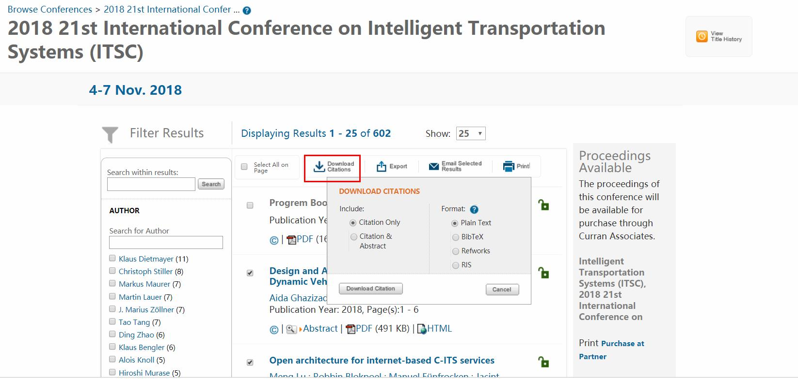
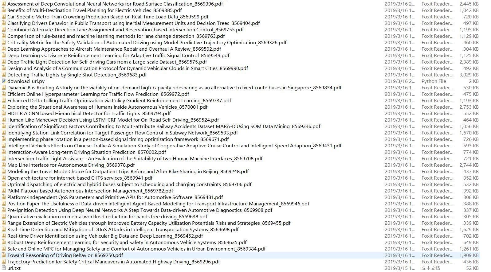

"# DownLoadIEEEPaper" 


该项目用于自动下载IEEE会议论文，并非免费下载论文，需要使用者拥有IEEE账户或者使用学校免费提供的具有下载功能的校园网。
以下说明以IEEE ITSC2018 会议论文下载为例。


## url文件说明 ##
url文件记录的每个论文的编号信息，其格式如下，具体可参考工程目录里面的url.txt文件：
```bash
A. Ghazizadeh and P. Ghazizadeh, "Design and Analysis of a Communication Protocol for Dynamic Vehicular Clouds in Smart Cities," 2018 21st International Conference on Intelligent Transportation Systems (ITSC), Maui, HI, 2018, pp. 1-6.
doi: 10.1109/ITSC.2018.8569990
keywords: {cloud computing;Internet of Things;protocols;public administration;smart cities;vehicular ad hoc networks;Internet of Things;city infrastructure interconnectivity;vehicle-to-infrastructure communication protocol;V2I communication protocol;dynamic Vehicular Cloud Computing system;vehicle-to-infrastructure;smart cities;Cloud computing;Virtualization;Virtual machine monitors;Smart cities;Containers;Vehicle dynamics},
URL: http://ieeexplore.ieee.org/stamp/stamp.jsp?tp=&arnumber=8569990&isnumber=8569013

M. Lu, R. Blokpoel, M. Fünfrocken and J. Castells, "Open architecture for internet-based C-ITS services," 2018 21st International Conference on Intelligent Transportation Systems (ITSC), Maui, HI, 2018, pp. 7-13.
doi: 10.1109/ITSC.2018.8569941
keywords: {intelligent transportation systems;mobile radio;vehicular ad hoc networks;wireless LAN;short-range ad-hoc local network;IEEE 802.11p standard;cellular network;substantial standardisation efforts;cellular solutions;vehicular communication;open broker-centric architecture;scalable broker-centric architecture;short-range communication;infrastructure server;information broker;transport layer security;open architecture;Cooperative Intelligent Transport Systems;Internet-based C-ITS services;Europe;Standards;Roads;Interoperability;Protocols;Security;Virtual private networks;C-ITS;architecture;interoperability;security;privacy;road transport},
URL: http://ieeexplore.ieee.org/stamp/stamp.jsp?tp=&arnumber=8569941&isnumber=8569013

A. Stevanovic and N. Mitrovic, "Combined Alternate-Direction Lane Assignment and Reservation-based Intersection Control," 2018 21st International Conference on Intelligent Transportation Systems (ITSC), Maui, HI, 2018, pp. 14-19.
doi: 10.1109/ITSC.2018.8569755
keywords: {road traffic;road traffic control;scheduling;traffic engineering computing;traffic flows;urban networks;urban intersections;urban traffic systems;recent conflict resolution concepts;fundamentally different approach;directional driving paths;reservation-based algorithm;three-intersection corridor;conflicting situations;fully reservation-based intersection control;CADLARIC;combined alternate-direction lane assignment and reservation-based intersection control;FR-BIC;Roads;Computational modeling;Tools;Delays;Geometry;Vehicle dynamics;Automobiles;traffic control;simulation;scheduling;conflict resolution;alternate directional driving},
URL: http://ieeexplore.ieee.org/stamp/stamp.jsp?tp=&arnumber=8569755&isnumber=8569013

......
```


## 准备你的url文件 ##
在相应的会议页面导出url信息，粘贴为一个新的url文件。




## 运行 ##
将python文件与url文件放置在同一个目录下面，运行python文件即可， **需要连接可于下载的网络**。
论文下载完成，如下：


